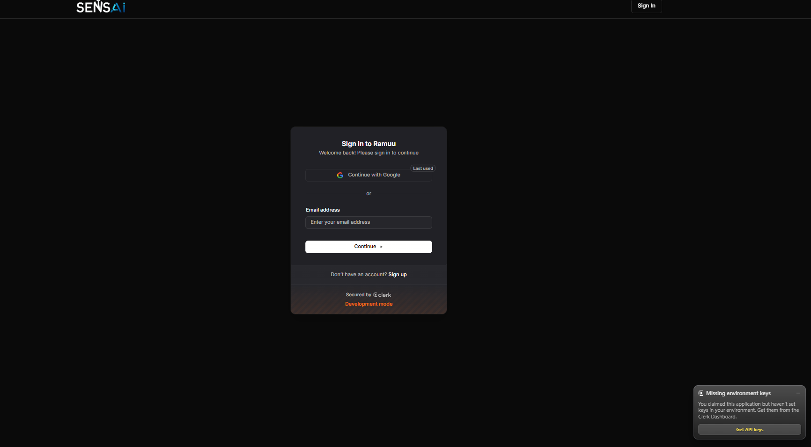
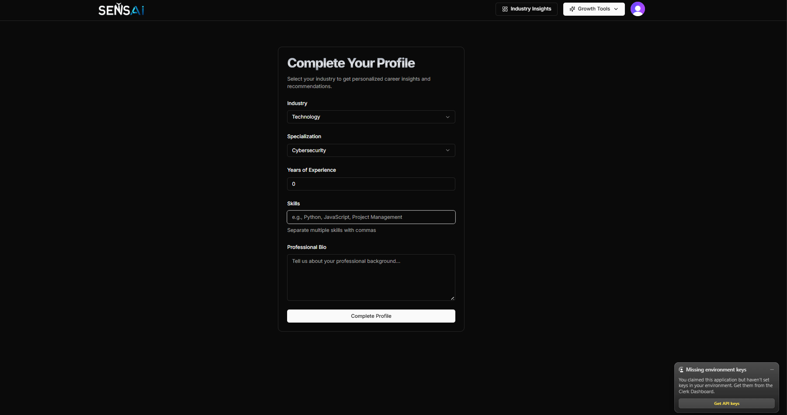
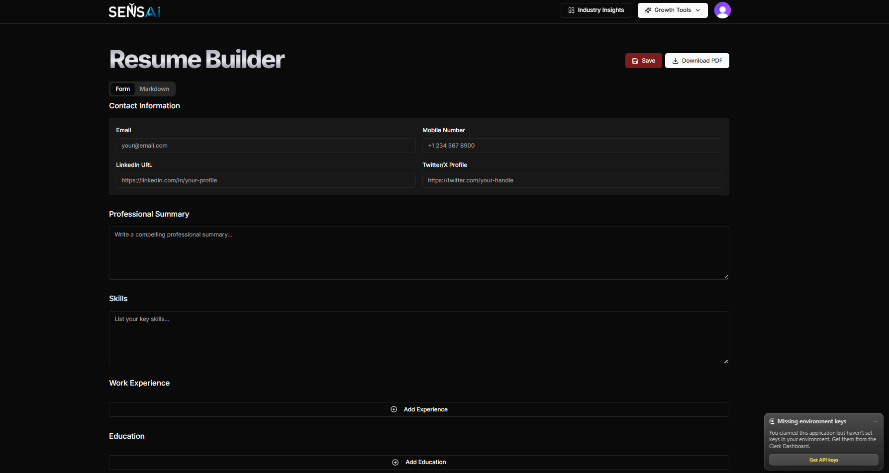

# SENSAI - AI Career Assistance Portal

## Overview

SENSAI is an AI-powered Career Assistance Portal designed to help students and job seekers improve their career readiness. The platform provides resume analysis, AI-generated cover letters, interview preparation, career guidance, and industry insights using modern web technologies and artificial intelligence.

## Features

* AI Resume Builder and Analyzer
* AI-Powered Cover Letter Generator
* Mock Interview Preparation
* Personalized Career Guidance
* Industry Insights and Skill Recommendations
* User Authentication and Authorization
* Dashboard for Tracking Career Progress
* Responsive and Modern UI
## Screenshots

### Home Page
The landing page introduces users to SENSAI and highlights its AI-powered career development features.


---

### Login Page
Secure authentication using Clerk Authentication for user sign-in and account management.



---

### Profile Dashboard
Users can manage their profiles, track progress, and access personalized career recommendations.



---

### AI Resume Builder
Build professional resumes with AI assistance and receive intelligent suggestions for improvement.



## Tech Stack

### Frontend

* Next.js 15
* React.js
* Tailwind CSS
* Shadcn UI

### Backend

* Next.js Server Actions
* Prisma ORM
* PostgreSQL (Neon DB)

### Authentication

* Clerk Authentication

### Artificial Intelligence

* Google Gemini API

### Deployment

* Rander

## Project Structure

```text
app/
components/
actions/
lib/
prisma/
public/
hooks/
data/
```

## Installation

### Clone Repository

```bash
git clone <repository-url>
cd CAREER-ASSISTANCE-PORTAL
```

### Install Dependencies

```bash
npm install
```

## Environment Variables

Create a `.env` file in the root directory and add:

```env
DATABASE_URL="your_neon_database_url"

NEXT_PUBLIC_CLERK_PUBLISHABLE_KEY="your_clerk_publishable_key"
CLERK_SECRET_KEY="your_clerk_secret_key"

NEXT_PUBLIC_CLERK_SIGN_IN_URL="/sign-in"
NEXT_PUBLIC_CLERK_SIGN_UP_URL="/sign-up"
NEXT_PUBLIC_CLERK_AFTER_SIGN_IN_URL="/onboarding"
NEXT_PUBLIC_CLERK_AFTER_SIGN_UP_URL="/onboarding"

GEMINI_API_KEY="your_gemini_api_key"
```

## Database Setup

Push Prisma schema to the database:

```bash
npx prisma db push
```

Generate Prisma Client:

```bash
npx prisma generate
```

## Running the Project

Start the development server:

```bash
npm run dev
```

Open:

```text
http://localhost:3000
```

## Future Enhancements

* AI Career Roadmaps
* Resume ATS Scoring
* Job Recommendation Engine
* Skill Gap Analysis
* Learning Path Generator
* Multi-language Support

## Author

Marapelly Ramu

B.Tech - Computer Science and Engineering

Interests:

* Full Stack Development
* Artificial Intelligence & Machine Learning
* Ethical Hacking & Cybersecurity

## License

This project is developed for educational and portfolio purposes.
